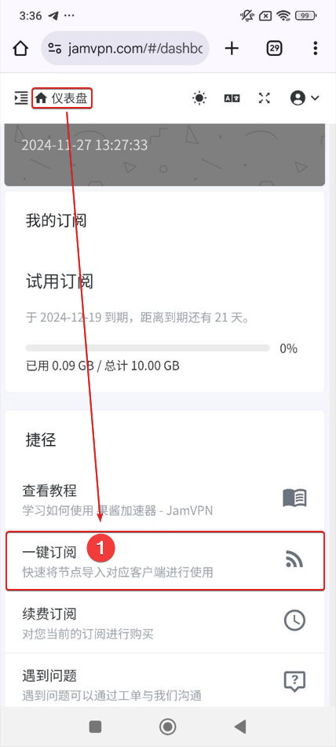

# Shadowrocket教程

**第一步：安装Shadowrocket**

因中国区AppStore禁止上架翻墙产品。需要一个国外的苹果账号，购买Shadowrocket应用

如果你没有，那么可以通过以下三种渠道获取

1、直接购买

[点击访问香港AppStore](https://apps.apple.com/hk/app/shadowrocket/id932747118) | [点击访问美国AppStore](https://apps.apple.com/us/app/shadowrocket/id932747118)

2、联系官方协助代购

[Telegram官方群组](https://t.me/JamVPNCustomer) | 网页在线客服

3、通过第三方供应商

[点击访问三方商店](https://ttmh.ewdwwee.com.cn/)

**第二步：访问官网，获取订阅**

<figure><figcaption>
在首页仪表盘点击一键订阅
</figcaption></figure>

在首页仪表盘点击一键订阅打开订阅弹窗

<figure><figcaption></figcaption></figure>

点击【导入到Shadowrocket】一键启动Shadowrocket

<figure><figcaption></figcaption></figure>

**第三步：连接使用**

首次安装时需要授权

<figure><figcaption></figcaption></figure>

授权完成后即可连接

**第四步：模式配置**

<figure><figcaption></figcaption></figure>

