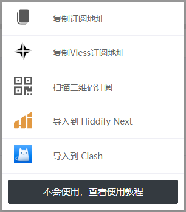
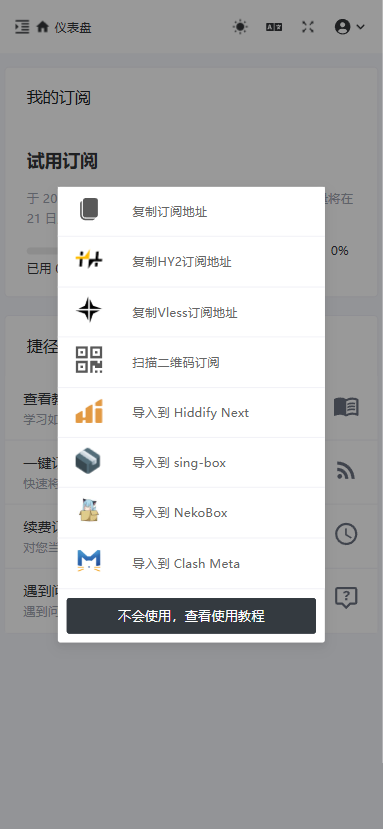

# 订阅获取

根据你的客户端类型获取订阅，Clash类内核客户端选择【导入到Clash】，其他类型客户端，Hiddify Next客户端选择【Hiddify Next】，其他客户端选择【复制订阅地址】、【复制Vless订阅地址】或【扫描二维码订阅】皆可。

一、从PC（windows或Mac系统）官网获取订阅的位置：

<figure><figcaption>
在仪表盘-一键订阅处找到订阅类型列表
</figcaption></figure>

<figure><figcaption>
订阅类型列表
</figcaption></figure>

二、从Mobile（Android或IOS）官网获得订阅的位置

<figure><figcaption>
在仪表盘-一键订阅处找到订阅类型列表
</figcaption></figure>

<figure><figcaption></figcaption></figure>
